<div align="center">



<a href="https://git.io/typing-svg"></a>

<br>

<a href="https://www.linkedin.com/in/mohsin-khan-2002ba3a8"></a>
<a href="mailto:mohsin161955@gmail.com"></a>
<a href="https://mastodon.social/@Mohsin"></a>
<a href="https://www.facebook.com/share/p/1BsUQF93ku/"></a>

</div>

---




---

## 🌐 Featured Project

### 🏢 Enterprise Multi-Branch Network: Lahore HQ ↔ Islamabad Branch


```

**Highlights:** VLAN segmentation · Router-on-a-Stick · HSRP high availability · OSPF · LACP EtherChannel · DHCP · NAT/PAT with VPN exemption · Extended ACLs · Port Security · SSH · Site-to-Site IPsec VPN

---

## 📂 Projects


<table>
<tr>
<td width="50%"><a href="https://github.com/mohsinswengpy/-Enterprise-Multi-Branch-Infrastructure-Redundant-Network-Architecture"></a></td>
<td width="50%"><a href="https://github.com/mohsinswengpy/OSPF-Multi-Area-Routing-Cisco-Packet-Tracer"></a></td>
</tr>
<tr>
<td width="50%"><a href="https://github.com/mohsinswengpy/OSPF-Dynamic-Routing-Failover"></a></td>
<td width="50%"><a href="https://github.com/mohsinswengpy/vlan-segmentation-trunking-lab"></a></td>
</tr>
<tr>
<td width="50%"><a href="https://github.com/mohsinswengpy/dhcp-nat-acl-networking-lab"></a></td>
<td width="50%"></td>
</tr>
</table>


## 📊 GitHub Stats

<div align="center">


</div>

---

## 🐍 Contribution Snake

<div align="center">

<picture>
  <source media="(prefers-color-scheme: dark)" srcset="https://raw.githubusercontent.com/mohsinswengpy/mohsinswengpy/output/github-snake-dark.svg" />
  <source media="(prefers-color-scheme: light)" srcset="https://raw.githubusercontent.com/mohsinswengpy/mohsinswengpy/output/github-snake.svg" />
  
</picture>

</div>

---

<div align="center">

### 🤝 Need a network designed, configured or troubleshot? Let's connect!

<a href="mailto:mohsin161955@gmail.com"></a>


</div>
