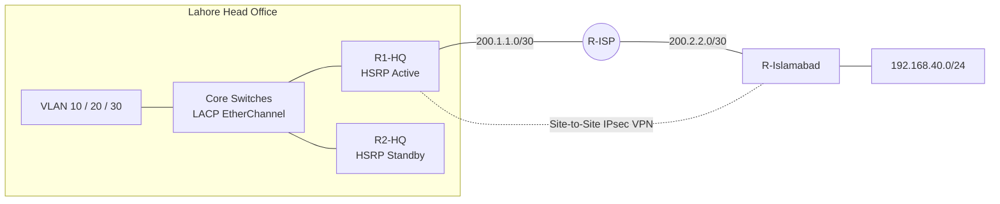

 

---

## 👨‍💻 About Me

I'm a **Software Engineering student** building a career in **network engineering**. I design networks that are **reliable, secure and scalable**, and I learn by building: every concept becomes a hands-on lab with documented configs and verification.

| | |
|---|---|
| 🎯 **Goal** | CCNA → CCNP, then Network Automation and Cloud Networking |
| 🔭 **Currently** | Enterprise labs in Cisco Packet Tracer, moving to GNS3 + Python (Netmiko) |
| 🌱 **Next** | BGP, DMVPN, Network Automation, Monitoring (Zabbix / Grafana) |
| 💼 **Open to** | Junior network roles, internships and freelance lab / config work |

---

## 🌐 Featured Project

### 🏢 Enterprise Multi-Branch Network: Lahore HQ ↔ Islamabad Branch

**Highlights:** VLAN segmentation · Router-on-a-Stick · HSRP high availability · OSPF · LACP EtherChannel · DHCP · NAT/PAT with VPN exemption · Extended ACLs · Port Security · SSH · Site-to-Site IPsec VPN

---

## 📂 Projects

<table>
<tr>
<td width="50%">

</td>
<td width="50%">

</td>
</tr>
<tr>
<td width="50%">

</td>
<td width="50%">

</td>
</tr>
<tr>
<td width="50%">

</td>
<td width="50%">

| Skill area | Covered in |
|---|---|
| Switching | VLAN, Trunking, EtherChannel |
| Routing | OSPF Multi-Area, Failover |
| Redundancy | HSRP, Dual paths |
| Services | DHCP, NAT/PAT, ACL |
| Security | Port Security, SSH, IPsec |

</td>
</tr>
</table>

---

## 🛠️ Tech Stack

  

---

## 🚀 Roadmap

| Status | Goal |
|:---:|---|
| ✅ | CCNA-level labs: VLAN, OSPF, HSRP, NAT, ACL, IPsec VPN |
| 🔄 | Python network automation with Netmiko (ConfigGuardian) |
| 🔄 | CCNA certification |
| ⏳ | BGP + multi-site WAN (BGP-Bridge) |
| ⏳ | Monitoring with Zabbix / Grafana (NetPulse) |
| ⏳ | Firewall and security lab (FortressNet) |
| ⏳ | CCNP and Cloud Networking (AWS / Azure) |

---

## 📊 GitHub Stats

---

## 🐍 Contribution Snake

<picture>
  <source media="(prefers-color-scheme: dark)" srcset="https://raw.githubusercontent.com/mohsinswengpy/mohsinswengpy/output/github-snake-dark.svg" />
  <source media="(prefers-color-scheme: light)" srcset="https://raw.githubusercontent.com/mohsinswengpy/mohsinswengpy/output/github-snake.svg" />
  
</picture>

---

### 🤝 Need a network designed, configured or troubleshot? Let's connect!

